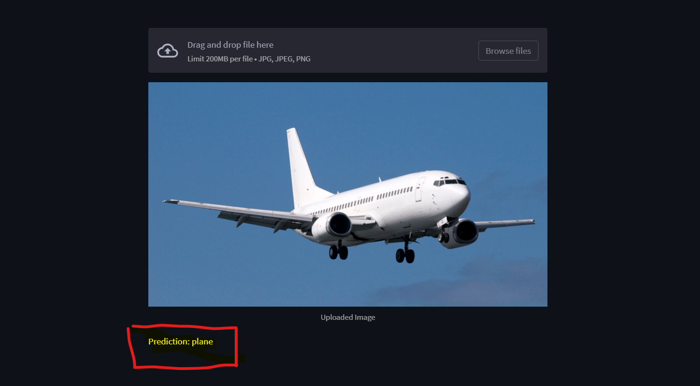

# Image Classification using PyTorch and Streamlit

This project is an image classification application using PyTorch and Streamlit. The model is trained on the CIFAR-10 dataset and can classify images into 10 different categories:
```
'plane', 'car', 'bird', 'cat', 'deer', 'dog', 'frog', 'horse', 'ship', 'truck'.

```

 

## Table of Contents

- [Features](#features)
- [Installation](#installation)
- [Usage](#usage)
- [Contributing](#contributing)
- [License](#license)

## Features

- Simple and intuitive UI built with Streamlit
- Fast and accurate image classification using a PyTorch model
- Easy to set up and run locally

## Installation

### Clone the repository

```
git clone https://github.com/RaheesAhmed/Image-Classifier.git
cd Image-Classifier
```
### Install dependencies

It is advisable to create a virtual environment before installing the dependencies.

```
pip install -r requirements.txt
```

## Usage

### To Train the Model

Run the training script to train the model on the CIFAR-10 dataset.

```
python image_classifier.py
```

This will save the trained model as `image_classifier.pth`.

### To Run the Streamlit App

Run the Streamlit app using the following command:

```
streamlit run main.py
```

A new tab will open in your default web browser displaying the Streamlit app.

## The CIFAR-10 dataset
The CIFAR-10 dataset consists of 60000 32x32 colour images in 10 classes, with 6000 images per class. There are 50000 training images and 10000 test images.

The dataset is divided into five training batches and one test batch, each with 10000 images. The test batch contains exactly 1000 randomly-selected images from each class. The training batches contain the remaining images in random order, but some training batches may contain more images from one class than another. Between them, the training batches contain exactly 5000 images from each class.

[You can Check it here](https://www.cs.toronto.edu/~kriz/cifar.html)

## Contributing

Pull requests are welcome. For major changes, please open an issue first to discuss what you would like to change.

## License

MIT
